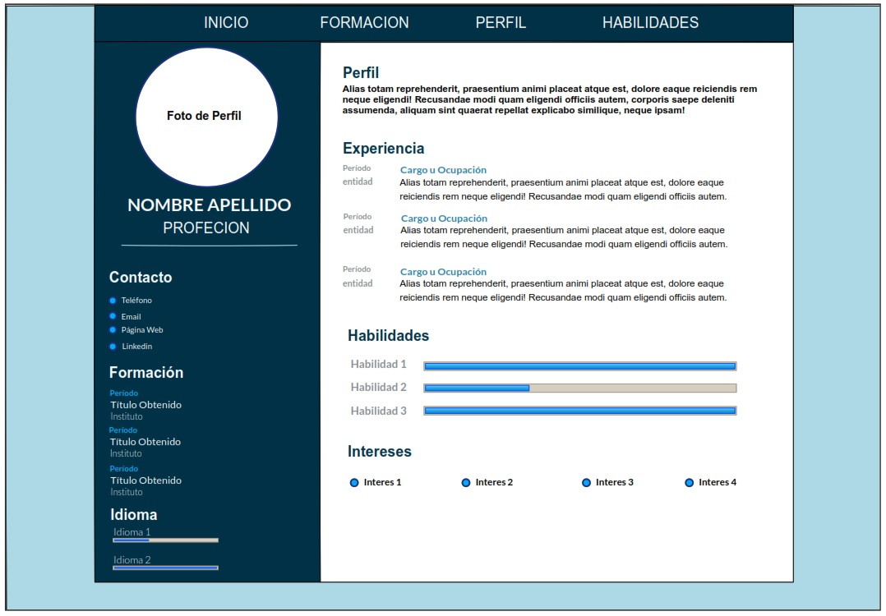
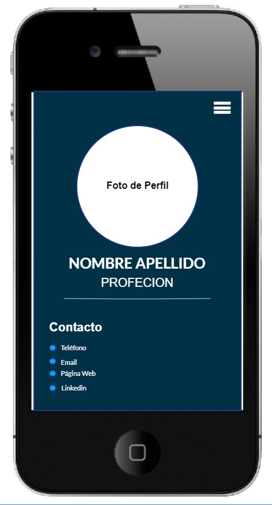

# Proyecto Final Integrador Ticmas Academy
## Primeros Pasos en el Desarrollo Front End
Se solicita la creación de un Currículum Vitae online para poner en practica los conocimientos adquiridos en el curso.
## Comentarios Sobre el Presente Proyecto
- Se aplicaron los conocimientos adquiridos, mas conocimientos previos.
- Idea sobre el diseño extraido de: 
    - [Canvas](https://www.canva.com/es_es/)
    - Canal de youtube de OT: [How to Create Responsive Resume Website using HTML and CSS](https://www.youtube.com/watch?v=hnjHCmaUVPg&t=176s)
- Menu desplegable es de una practica subido a Github.com y reutilizado con muchas modificaciones en este proyecto: [código](https://github.com/ariele2002/menu-responsive)
- No pude manejar el ancho del `header`, el `position: fixed` toma el viewport y no el contenedor, cualquier ayuda es bien recibida.

<h2 style="text-align: center">Boceto</h2>

<h2 style="text-align: center">Boceto Smartphone</h2>

## Recursos
- Diseño Bocetos: [Evolus Pensil](https://pencil.evolus.vn/)
- Fuentes: [Google Fonts](https://fonts.google.com/)
- Iconos: [Fontawesome](https://fontawesome.com/)
- Imagenes: [Pixabay](https://pixabay.com/)
- Recursos varios HTML, CSS, JavaScript: [Htmlcheatsheet](https://htmlcheatsheet.com/)
- Favicon: [favicon](https://www.favicon.cc/)
- Documentación:
    - [Developer Mozilla](https://developer.mozilla.org/es/)
    - [W3S](https://www.w3schools.com/)

Accede al proyecto [click aqui](https://github.com/ariele2002/ticmas_academy_tp1.github.io.git).
